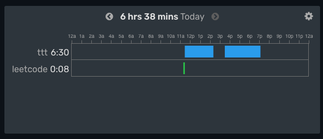

# ttt

This is a tic-tac-toe game built from scratch using vanilla TypeScript.
I opted for no state management frameworks to challenge myself to manage DOM updates manually

'onclick' events were used to handle state changes,
There definitely are optimizations that could be made in the logic,
but the naive solution seems to work fine for this exercise.

An important part of this was organizing the logic so that state changes could flow properly.
I now have a deeper appreciation for frameworks that handle DOM manipulation

### to start: npm run dev

#### build time: 6.5 hrs

